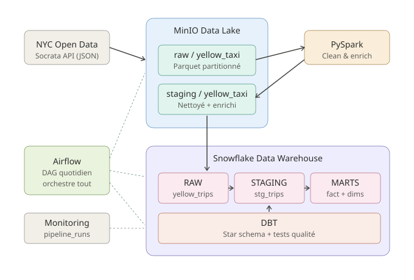

# Projet final — Stockage et traitement des données distribuées

Pipeline de données distribuée de bout en bout sur les courses de taxis jaunes de la ville de New York. De l'API publique jusqu'au modèle dimensionnel analytique dans Snowflake, orchestré par Airflow.

**Auteur** : Ivan
**Master 2 Data Engineer** — Soutenance : 19 mai

---

## Sommaire

1. [Présentation](#1-présentation)
2. [API utilisée](#2-api-utilisée)
3. [Description des données](#3-description-des-données)
4. [Architecture du pipeline](#4-architecture-du-pipeline)
5. [Outils utilisés](#5-outils-utilisés)
6. [Instructions d'exécution](#6-instructions-dexécution)
7. [Démonstration](#7-démonstration)
8. [Bonus](#8-bonus)

---

## 1. Présentation

L'objectif est de concevoir et implémenter une architecture de données moderne couvrant l'ensemble du cycle de vie de la donnée : **ingestion → stockage → traitement distribué → modélisation analytique → entrepôt de données**.

Le pipeline est entièrement automatisé via un DAG Airflow exécuté quotidiennement. Toute la stack tourne en Docker, ce qui rend le projet 100 % reproductible.

**Cas d'usage métier** : alimenter un modèle analytique permettant de répondre à des questions comme :

- Quels sont les quartiers les plus actifs aux heures de pointe ?
- Comment évolue le pourboire moyen en fonction de la zone et du jour de la semaine ?
- Quel est le revenu par fournisseur (vendor) et par mode de paiement ?

---

## 2. API utilisée

**NYC Open Data — Yellow Taxi Trip Records**

- Plateforme : [Socrata](https://data.cityofnewyork.us/) (gratuite, REST/JSON)
- Endpoint : `https://data.cityofnewyork.us/resource/{dataset_id}.json`
- Dataset utilisé : `t29m-gskq` (Yellow Taxi 2024)
- Authentification : un *App Token* gratuit (optionnel, recommandé pour éviter le throttling)

**Pourquoi cette API ?**

- Volumétrie réelle (millions de lignes par mois), donc Spark a un vrai intérêt
- Données structurées et bien documentées
- Permet une modélisation en étoile naturelle (1 fait : la course, et plusieurs dimensions : zone, date, vendor, paiement)
- Pagination native via `$limit` / `$offset`, filtrage SoQL via `$where`

---

## 3. Description des données

Chaque ligne représente **une course de taxi**. Les colonnes principales :

| Colonne | Type | Description |
|---|---|---|
| `vendorid` | int | Fournisseur (1=Creative Mobile, 2=VeriFone) |
| `tpep_pickup_datetime` | timestamp | Date/heure de prise en charge |
| `tpep_dropoff_datetime` | timestamp | Date/heure de dépose |
| `passenger_count` | int | Nombre de passagers |
| `trip_distance` | float | Distance en miles |
| `pulocationid` | int | Zone de prise en charge (FK vers les 265 zones TLC) |
| `dolocationid` | int | Zone de dépose |
| `payment_type` | int | Mode de paiement (1=carte, 2=cash, …) |
| `fare_amount` | float | Tarif de base |
| `tip_amount` | float | Pourboire |
| `tolls_amount` | float | Péages |
| `total_amount` | float | Montant total payé |

Le job Spark ajoute également : `trip_duration_min`, `avg_speed_mph`, `price_per_mile`, `tip_pct`, et plusieurs dimensions temporelles.

Le référentiel des **265 zones taxi** (borough, zone, service zone) est chargé via un seed DBT (`dbt_project/seeds/taxi_zones.csv`).

---

## 4. Architecture du pipeline



```
NYC Open Data API
        │
        ▼
   MinIO Data Lake
   ├── raw/yellow_taxi/year=/month=/day=/      (JSON converti en Parquet)
   └── staging/yellow_taxi/year=/month=/day=/  (post-Spark)
        │
        ▼
   Snowflake
   ├── RAW.YELLOW_TRIPS                        (chargement via COPY INTO)
   ├── STAGING.STG_TRIPS                       (vue DBT)
   └── MARTS                                   (modèle dimensionnel)
       ├── FACT_TRIPS
       ├── DIM_DATE
       ├── DIM_ZONE
       ├── DIM_VENDOR
       └── DIM_PAYMENT
```

Le tout est orchestré par un **DAG Airflow** (`dags/nyc_taxi_pipeline.py`) :

```
extract_api → spark_clean → load_snowflake → dbt_run → dbt_test → log_metrics
```

---

## 5. Outils utilisés

| Couche | Outil | Version | Rôle |
|---|---|---|---|
| Conteneurisation | Docker Compose | 2.x | Orchestre toute la stack locale |
| Orchestration | Apache Airflow | 2.10.3 | DAG quotidien |
| Data Lake | MinIO | latest | Stockage S3-compatible |
| Format de stockage | Parquet (Snappy) | — | Stockage columnaire |
| Traitement distribué | PySpark | 3.5.3 | Cleaning + enrichissement |
| Data Warehouse | Snowflake | cloud | Stockage analytique |
| Transformation | DBT | 1.8.7 | Modèle en étoile + tests |
| Monitoring | Table `pipeline_runs` | — | Métriques par étape |

---

## 6. Instructions d'exécution

### Prérequis

- Docker + Docker Compose
- Un compte Snowflake (essai gratuit de 30 jours suffisant)
- ~8 Go de RAM disponible

### Étape 1 — Cloner et configurer

```bash
git clone <ce-repo>
cd Projet_final_Stock_et_transformation_donnees
cp .env.example .env
# Éditer .env et renseigner les credentials Snowflake et le NYC_APP_TOKEN
```

### Étape 2 — Setup Snowflake

Se connecter à l'UI Snowflake (rôle `ACCOUNTADMIN`) et exécuter :

```sql
-- Le contenu de snowflake/01_setup.sql
```

Cela crée la base `NYC_TAXI`, les schémas `RAW`/`STAGING`/`MARTS`, le warehouse, le file format Parquet, le stage interne et la table cible.

### Étape 3 — Lancer la stack Docker

```bash
# Premier lancement uniquement : init Airflow
docker compose up airflow-init

# Démarrage de la stack
docker compose up -d
```

Vérifier que tout est up :

```bash
docker compose ps
```

### Étape 4 — Accéder aux interfaces

| Service | URL | Identifiants |
|---|---|---|
| Airflow UI | http://localhost:8085 | admin / admin |
| MinIO Console | http://localhost:9001 | minioadmin / minioadmin123 |
| Spark Master UI | http://localhost:8081 | — |

### Étape 5 — Configurer la connexion Spark dans Airflow

Dans Airflow UI → Admin → Connections, créer :

- **Conn Id** : `spark_default`
- **Conn Type** : `Spark`
- **Host** : `spark://spark-master`
- **Port** : `7077`

### Étape 6 — Exécuter le pipeline

Dans Airflow UI :

1. Activer le DAG `nyc_taxi_pipeline`
2. Cliquer sur **Trigger DAG w/ config** et passer une date connue, par exemple :
   ```json
   { "logical_date": "2024-01-15" }
   ```
3. Suivre l'exécution dans l'onglet **Graph**

### Étape 7 — Vérifier les résultats

```sql
-- Dans Snowflake
SELECT COUNT(*) FROM NYC_TAXI.RAW.YELLOW_TRIPS;
SELECT * FROM NYC_TAXI.MARTS.FACT_TRIPS LIMIT 10;

-- Top 5 zones de prise en charge
SELECT z.zone_name, z.borough, COUNT(*) AS nb_trips, AVG(f.total_amount) AS avg_fare
FROM NYC_TAXI.MARTS.FACT_TRIPS f
JOIN NYC_TAXI.MARTS.DIM_ZONE z ON f.pickup_zone_id = z.zone_id
GROUP BY z.zone_name, z.borough
ORDER BY nb_trips DESC
LIMIT 5;
```

---

## 7. Démonstration

Lors de la soutenance :

1. **Architecture** : présentation du schéma `docs/architecture.svg` et explication du flux
2. **Démarrage de la stack** : `docker compose up -d` en live
3. **Trigger du DAG** : exécution dans Airflow UI avec une date de janvier 2024
4. **Suivi** :
   - Logs Airflow
   - Apparition des fichiers dans MinIO Console (`raw/` puis `staging/`)
   - Spark UI pendant l'exécution du job
   - Lignes en table dans Snowflake après chargement
   - Modèles DBT créés dans `MARTS`
5. **Requêtes analytiques** dans Snowflake pour montrer la qualité du modèle
6. **Monitoring** : table `pipeline_runs` montrant les métriques par étape

---

## 8. Bonus

### 8.1 Monitoring

Une table `NYC_TAXI.RAW.PIPELINE_RUNS` est alimentée à chaque exécution avec :

- `run_id`, `execution_date`
- Étape (extract, spark, load, dbt)
- Statut, durée, nombre de lignes traitées, message d'erreur éventuel

Requête pour le suivi :

```sql
SELECT * FROM NYC_TAXI.RAW.PIPELINE_RUNS
ORDER BY created_at DESC
LIMIT 20;
```

### 8.2 Tests de qualité DBT

Les modèles incluent des tests automatiques (unique, not_null, relationships) qui s'exécutent à chaque run :

- Cohérence des clés primaires de toutes les dimensions
- Intégrité référentielle entre `fact_trips` et chaque dimension
- Non-nullité des colonnes critiques

Résultats consultables avec :

```bash
docker compose exec airflow-webserver bash -c \
  "cd /opt/airflow/dbt_project && dbt test --profiles-dir ."
```

### 8.3 Pistes d'extension

- **Grafana** branché sur `pipeline_runs` pour un dashboard en temps réel
- **Streamlit** ou **Metabase** branché sur Snowflake pour une couche dataviz
- Passage du DAG en **incremental** plutôt qu'en full refresh
- Mise en place de **DBT snapshots** pour tracker l'évolution des dimensions

---

## Structure du projet

```
.
├── README.md
├── docker-compose.yml
├── requirements.txt
├── .env.example
├── docs/
│   └── architecture.svg
├── dags/
│   └── nyc_taxi_pipeline.py            # DAG Airflow
├── ingestion/
│   └── extract_api.py                  # API → MinIO
├── spark_jobs/
│   └── clean_and_enrich.py             # Spark RAW → STAGING
├── snowflake/
│   ├── 01_setup.sql                    # Setup initial
│   └── load_to_snowflake.py            # MinIO → Snowflake
└── dbt_project/
    ├── dbt_project.yml
    ├── packages.yml
    ├── profiles.yml.example
    ├── seeds/
    │   └── taxi_zones.csv              # 265 zones TLC
    └── models/
        ├── staging/
        │   ├── sources.yml
        │   └── stg_trips.sql
        └── marts/
            ├── schema.yml
            ├── dim_date.sql
            ├── dim_vendor.sql
            ├── dim_payment.sql
            ├── dim_zone.sql
            └── fact_trips.sql
```
